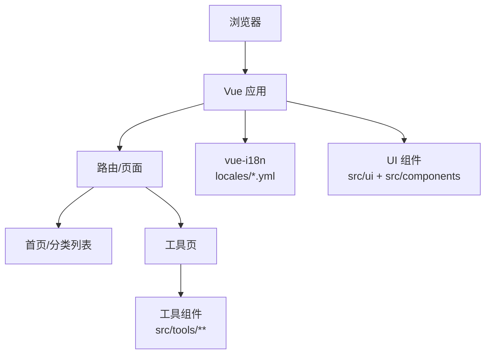

# 架构设计

## 1. 总体架构

---

## 2. 工具加载与分类

- 工具元信息通过 `src/tools/**/index.ts` 注册，并在 `src/tools/index.ts` 聚合为分类列表。
- 工具组件采用懒加载：`component: () => import('./xxx.vue')`，降低首屏体积。
- 分类与展示侧通过 i18n 映射为可本地化名称（见 `locales/*.yml` 的 `tools.categories.*`）。

---

## 3. 国际化（i18n）架构

- i18n 插件：`src/plugins/i18n.plugin.ts`
  - 默认语言 `zh`，回退语言 `en`
  - 提供 `translate(localeKey)`：用于工具元信息（title/description）在 key 缺失时回显 key，便于发现缺漏
- 语言包：`locales/*.yml`
  - 工具级：`tools.<tool-key>.*`
  - 公共组件级：`ui.*`

---

## 4. 测试与质量

- 单元测试：Vitest（`pnpm test:unit`）
- E2E：Playwright（`pnpm test:e2e`）
- Lint：ESLint（`pnpm lint`）

---

## 5. 部署形态

- 静态站点构建产物可通过任意静态文件服务部署。
- 仓库包含 `Dockerfile` 与 `nginx.conf`，用于容器化与 Nginx 部署场景。

